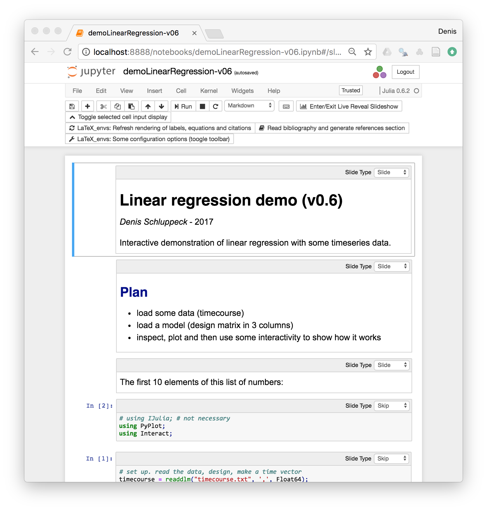

# Linear regression with ``julia``

A simple interactive Jupyter notebook that shows the connection between a design matrix, beta weights and an ordinary least squares (OLS) model fit.

The data is an example timeseries from human visual cortex (functional magnetic resonance imaging, fMRI response).

To run, ``git clone`` the repo, make sure you have ``julia`` installed.

```julia
# you may have to
# Pkg.add("IJulia")
# Pkg.add("Interact")

using IJulia
notebook()
# then navigate to the notebook
# step through using play button
```

<div alignment="center">
  
</div>
